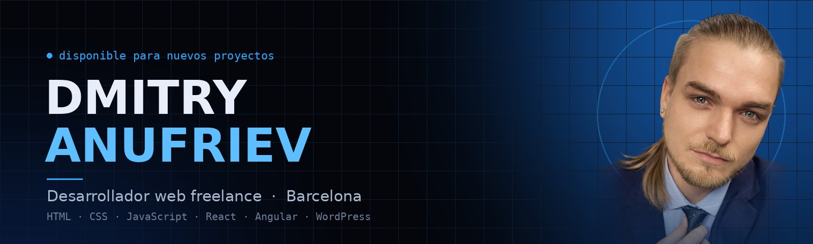
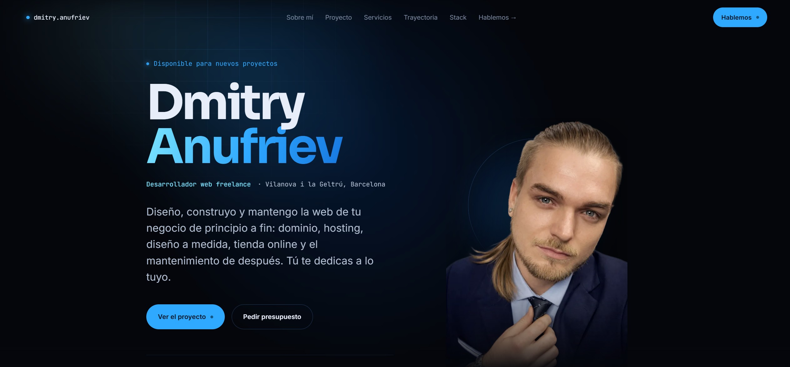
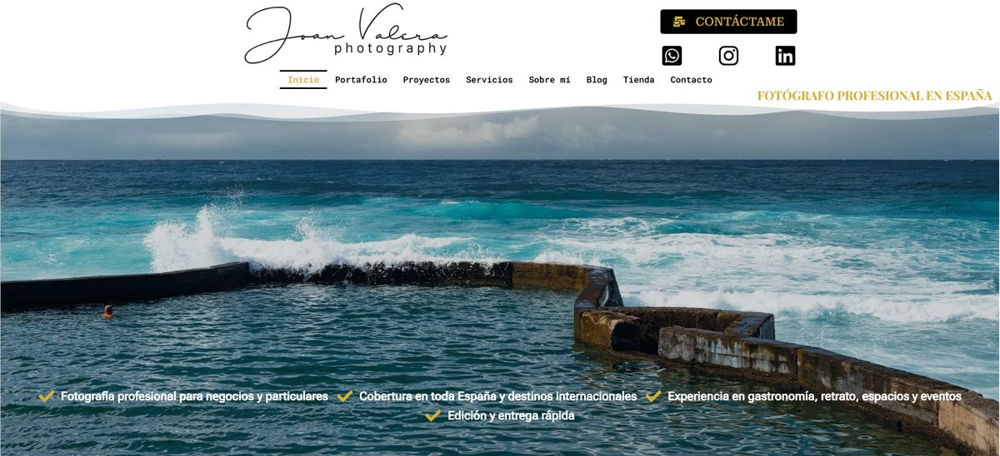

<!-- ============================================================
     Perfil de GitHub · Dmitry Anufriev
     Banner e imágenes en /assets. Badges: shields.io
     ============================================================ -->

  
  
  
  

## Hola, soy Dmitry 👋

Desarrollador web freelance en Vilanova i la Geltrú (Barcelona). Diseño, construyo y mantengo webs y tiendas online para pequeños negocios y autónomos: desde el dominio y el hosting hasta el diseño a medida, el SEO y el mantenimiento de después.

Mi formación es autodidacta, con cursos certificados en Udemy de HTML, CSS, JavaScript, React y Angular, y la pongo a prueba en proyectos reales para clientes reales.

- 🌐 **Webs a medida** en WordPress o código propio, pensadas para móvil desde el principio
- ⚡ **Rendimiento y SEO** como parte del trabajo, no como extra
- 🛠️ **Mantenimiento continuado** para que el cliente no tenga que tocar nada
- 🗣️ Español · Català · Русский · English

## Stack

<table>
<tr>
<td><b>Frontend</b></td>
<td>

</td>
</tr>
<tr>
<td><b>CMS y e-commerce</b></td>
<td>

</td>
</tr>
<tr>
<td><b>Hosting y herramientas</b></td>
<td>

</td>
</tr>
<tr>
<td><b>SEO y analítica</b></td>
<td>

</td>
</tr>
</table>

  Formación certificada en Udemy: HTML, CSS y JavaScript · React · Angular

## Proyectos destacados

<table>
<tr>
<td width="50%" valign="top">

### Portfolio personal

Web de una página hecha a mano, **sin frameworks ni dependencias**. Diseño oscuro con acentos neón, iluminación que sigue al cursor, revelado al hacer scroll y menú móvil accesible. Todo en unos 240 KB.

  

**[🌐 Ver web](https://rusjokah.github.io)** · **[💻 Ver código](https://github.com/RusJokah/RusJokah.github.io)**

</td>
<td width="50%" valign="top">

### joanvalera.com

Web profesional para **Joan Valera**, fotógrafo de Barcelona con más de 20 años de experiencia. WordPress en Hostinger, maquetado con Elementor y ampliado con **CSS y JavaScript propios**, SEO on-page e integración con Pic-Time para la entrega y venta de galerías.

   

**[🌐 Ver web](https://www.joanvalera.com)**

</td>
</tr>
</table>

<!--- stats & Trophy (start) -->

## Servicios

Diseño web · Tiendas online · SEO · Mantenimiento · Diseño gráfico · Soporte informático

→ Todos los detalles y precios orientativos en **[mi portfolio](https://rusjokah.github.io/#servicios)**.

## Contacto

¿Tienes un proyecto en mente? Escríbeme con dos líneas sobre tu negocio y te respondo con una propuesta concreta.

  
  

